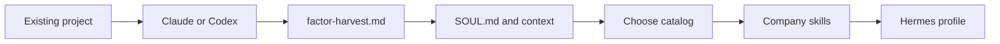

<div align="center">


</div>

<!-- readme-gen:start:badges -->
<div align="center">


</div>
<!-- readme-gen:end:badges -->

<!-- readme-gen:start:tech-stack -->
<p align="center">
  
</p>
<!-- readme-gen:end:tech-stack -->

<!-- readme-gen:start:social -->
<div align="center">


</div>
<!-- readme-gen:end:social -->

> A company already lives in the repo you have been building. **Factor** sends Claude or Codex back into that repo, writes who the owner is into `SOUL.md`, and only then lets you pick the skills, plugins, and tools that company will use.


<table>
<tr>
<td width="50%" valign="top">

### Harvest first
Paste one prompt into Claude or Codex inside the existing project. Missing facts stay blank.

</td>
<td width="50%" valign="top">

### Soul before tools
The harvest becomes `SOUL.md` and six context files. Tools come after that.

</td>
</tr>
<tr>
<td width="50%" valign="top">

### Two seats
Claude judges and writes. Codex builds, on a Kanban card, in a worktree.

</td>
<td width="50%" valign="top">

### Opt-in catalog
Sixty bookmark tools sit in `catalog/cards/`. A company copies only the ones it chooses.

</td>
</tr>
</table>

## Quick start

```bash
git clone https://github.com/Sheshiyer/factor.git
cd factor
scripts/new-company.sh acme ~/companies/acme
```

Hermes Agent 0.21 or newer:

```bash
hermes profile install "$PWD" --name factor --alias
hermes -p factor model
```

Pick a Claude model for `factor`. The Codex profile is in [docs/seats.md](docs/seats.md).

## Onboarding

Four steps, in this order. `scripts/onboard.py --steps` prints them.

1. In the project you have been building, paste [prompts/harvest-claude.md](prompts/harvest-claude.md) into Claude, or [prompts/harvest-codex.md](prompts/harvest-codex.md) into Codex. Save `factor-harvest.md`.
2. Apply it. This writes `SOUL.md`, the context files, and the business and brand folders. `wiki/index.md` is the catalog. `brand/` holds voice, proof, and the lock.

```bash
scripts/onboard.py --prompt claude
scripts/onboard.py --company ~/companies/acme \
  --apply-harvest ~/src/the-project/factor-harvest.md
```

3. Choose skills, plugins, and other capabilities.

```bash
scripts/onboard.py --text --category skills
scripts/onboard.py --company ~/companies/acme --enable openspec,ffmpeg-skill
```

4. Confirm.

```bash
python3 scripts/check_company.py ~/companies/acme
hermes -p factor config set skills.config.factor.company_root ~/companies/acme
```

A line that still says `FILL:` is unknown. The agent stops there. Public sends, spend, and paid calls wait for an approval comment. Composio is a separate example in [connectors/composio.example.yaml](connectors/composio.example.yaml). It is not in the catalog.


<!-- readme-gen:start:architecture -->

<!-- readme-gen:end:architecture -->

<!-- readme-gen:start:tree -->
```
factor
├── catalog/cards/     # 60 offered tools, copied only when chosen
├── company/           # blank glove: SOUL, context, connectors
├── connectors/        # registry, catalog notes, Composio example
├── docs/              # Claude and Codex seats
├── prompts/           # harvest prompts to paste
├── scripts/           # new-company, onboard, check
├── skills/            # operator skills installed with the profile
└── tests/             # unittest
```
<!-- readme-gen:end:tree -->

The older [snow-gloves-os](https://github.com/Sheshiyer/snow-gloves-os) repo is a separate project.

<!-- readme-gen:start:health -->
## Project health

| Category | Status | Score |
|:---------|:------:|------:|
| Tests | ████████░░░░░░░░░░░░ | 40% |
| CI | ░░░░░░░░░░░░░░░░░░░░ | 0% |
| Type hints | ████████░░░░░░░░░░░░ | 40% |
| Documentation | ████████████████░░░░ | 80% |
| Coverage | ░░░░░░░░░░░░░░░░░░░░ | 0% |

> **Overall: 32%.** Eleven unittest cases pass. There is no workflow and no coverage config yet.
<!-- readme-gen:end:health -->

## License

MIT. See [LICENSE](LICENSE).

<!-- readme-gen:start:footer -->
<div align="center">


</div>
<!-- readme-gen:end:footer -->
