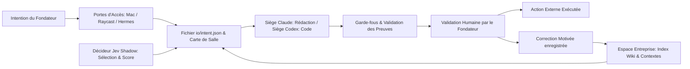

# Guide de l’écosystème Factor : Architecture, Gestion de la Connaissance et Apprentissage Procédural

**Date du rapport :** 27 septembre 2026  
**Auteur :** Architecte Logiciel Senior & Rédacteur Technique Spécialisé en Systèmes Multi-Agents et Architecture de Connaissance  
**Statut du document :** Synthèse d'architecture canonique et état de vérité du système  

---

## 1. Introduction, Statut Actuel et Matrice de Vérité (`00-current-truth`)

Ce rapport établit l'état de vérité canonique de l'écosystème Factor au **27 septembre 2026**. En cas de divergence entre des documentations historiques, des annonces de fonctionnalités ou des spécifications d'architecture passées, le fichier `00-current-truth.md` et les vérifications datées de ce document prévalent de manière absolue sur toute autre source.

L'écosystème Factor ne prétend pas documenter l'ensemble des projets ou services locaux environnants, mais se concentre strictement sur l'articulation entre le fondateur, le dépôt de l'espace entreprise en Markdown/Git, le framework Factor, les portes d'entrée applicatives, le runtime Hermes, les sièges Claude/Codex, la frontière de décision Jev, la capture de recherche Field Theory, ainsi que les primitives de connaissance, de correction et de validation humaine.

Pour éviter tout risque d'ambiguïté concernant l'état du système, les capacités techniques sont classées selon cinq niveaux de statut distincts :
1. **Version livrée baseline** : La version v0.5.0 du framework Factor (commit `795ae67`).
2. **Additions vérifiées localement** : Le code validé sur la branche `codex/factor-knowledge-curation` jusqu'au commit `b00dfcd`.
3. **Capacités installées Hermes** : Le moteur Hermes en version 0.21.5 au commit `645da6561c724b7ca163d4af9c21de3a6397c9f2`.
4. **Pilotes de runtime proposés** : Les configurations et processus d'apprentissage procédural non encore exécutés ou déployés en production.
5. **Idées différées** : Les moteurs de mémoire externes (Hindsight, memU, OpenViking) et les intégrations spécialisées (OSINT, production vidéo).

### Matrice de Vérité du Système

| Composant / Élément | Statut Système | Référence Commit / Version | Niveau de Validation |
| :--- | :--- | :--- | :--- |
| **Factor Framework Baseline** | Version livrée baseline | v0.5.0 (commit `795ae67`) | Livré / 58 cartes GitHub closes |
| **Curation de Connaissance & Moteur de Procédure** | Additions vérifiées localement | Branche `codex/factor-knowledge-curation` (`b00dfcd`) | Validé localement (237 tests réussis) |
| **Hermes Runtime Engine** | Capacités installées Hermes | v0.21.5 (commit `645da6561c724b7ca163d4af9c21de3a6397c9f2`) | Audité sur code source installé |
| **Profils / Sièges Hermes (`factor`, `coder`)** | Pilotes de runtime proposés | Non vérifiés sur une entreprise active | Configuration non inspectée en production |
| **Portes applicatives (Menu Mac, Raycast, Hermes)** | Version livrée baseline | v0.3.0 (Mac), v0.4.0 (Raycast/Hermes) | Intégration CLI & scripts validée |
| **Moteur de Décisions Shadow Jev** | Additions vérifiées localement | Implémentation locale `jev_decisions.py` | Fixtures synthétiques sans appels LLM |
| **Intake Signets Field Theory (FT)** | Additions vérifiées localement | Script `ingest_bookmarks.py` (7 posts, 12 sources) | Testé sur cache réel (15 tests dédiés) |
| **Moteurs Mémoire Extérieurs (Hindsight, etc.)** | Idées différées | Aucun code intégré | Différé (Évaluation future) |
| **Outils OSINT et Pipelines Vidéo (ViMax, etc.)** | Idées différées | Repertoire d'identités (44 dépôts candidats) | Différé (0 dépôt installé par défaut) |

---

## 2. La Métaphore de la Main et du Gant : Autorité Humaine et Principes Directeurs

L'architecture globale de Factor repose sur une séparation rigoureuse des responsabilités, modélisée par la métaphore de la Main, du Gant et du Cadre :

* **La Main (Hermes Runtime)** : C'est le moteur d'exécution autonome. Il gère les sessions, le déroulement des tours de rôle, l'historique de conversation et l'invocation des outils. La main apporte la capacité d'action mais ne possède pas la mémoire métier.
* **Le Gant (Espace Entreprise / Company Repo)** : C'est le dépôt Git/Markdown propre à l'entreprise. Il contient la voix exacte du fondateur, les faits vérifiés, le wiki, l'historique des corrections et le registre des décisions. Le gant donne sa forme, ses limites et son identité à la main.
* **Le Cadre (Factor Framework)** : C'est le modèle opérationnel réutilisable qui ajuste la main au gant. Il fournit les playbooks de salles, les scripts de vérification, la structure d'onboarding et les mécanismes d'ajustement du gant à la main.
* **Le Fondateur** : Il est le détenteur exclusif de l'autorité décisionnelle. L'agent effectue le travail de recherche, de synthèse et de rédaction, mais toute action conséquente (*send, spend, publish* — envoyer, dépenser, publier) exige impérativement une validation humaine explicite.

### Justification Architecturale de la Mémoire sur Disque
La conservation de la mémoire entreprise sous forme de fichiers Markdown sur disque (plutôt que par réinjection systématique du corpus dans le contexte LLM) est un choix d'ingénierie fondamental. Injecter l'intégralité du wiki à chaque tour de rôle entraîne une dégradation rapide de la précision du modèle (phénomène de dilution d'attention au centre de la fenêtre de contexte), une hausse exponentielle du coût en jetons, et un risque accru d'hallucination. L'architecture sur disque impose une lecture ciblée : l'agent lit uniquement l'index `wiki/index.md`, puis charge exclusivement la page nécessaire au traitement de la tâche courante.



---

## 3. Matrice de Responsabilité des Composants de l'Écosystème

Afin de garantir une parfaite étanchéité entre les plans d'exécution, de stockage et de décision, les responsabilités de chaque composant logiciel ou humain sont strictement délimitées.

| Composant | Responsabilité Principale | Ce qu'il possède (Durable) | Ce qu'il ne doit JAMAIS modifier directement |
| :--- | :--- | :--- | :--- |
| **Factor Framework** | Fournir les structures d'entreprise, les scripts CLI de vérification et les playbooks réutilisables. | Les modèles de salles, le script d'onboarding, les utilitaires de validation. | Les données privées d'un espace entreprise ou la configuration d'un profil Hermes. |
| **Espace Entreprise** | Conserver la vérité factuelle, la voix métier, les sources et le registre d'approbations. | `instinct.md`, `profile-soul.md`, `wiki/`, `wiki/corrections.md`, `wiki/knowledge.json`. | Le code source du runtime Hermes ou les poids du modèle LLM. |
| **Hermes Runtime** | Orchestrer les sessions, l'exécution des compétences, l'apprentissage procédural et les appels d'outils. | La base de données de sessions SQLite FTS5, le stockage de compétences locales du profil. | Le contenu canonique du wiki de l'espace entreprise ou les règles de politique générale. |
| **Siège Claude (`factor`)** | Gérer le Kanban, planifier, rédiger les contenus, mettre à jour le contexte et traiter la connaissance. | La logique de dispatch Kanban, les projets de rédaction sous `output/`. | Le code source de l'application ou l'exécution directe de cartes assignées au siège Codex. |
| **Siège Codex (`coder`)** | Traiter les cartes de code technique dans un *worktree* isolé (profil créé via `--no-skills`). | Les modifications de code source dans les branches de travail Git. | La gestion du Kanban global, la rédaction de contenus marketing ou la voix de l'entreprise. |
| **Field Theory (FT)** | Capter, dédupliquer et mettre en cache les signets, articles et liens externes bruts. | Le cache JSONL brut des publications et articles externes. | Le wiki de l'espace entreprise (les captures brutes sont des données non vérifiées, jamais une vérité entreprise). |
| **Décideur Jev** | Classer et sélectionner les options (salles, pages, besoins d'intervention) selon un score de confiance. | Les reçus de décision synthétiques et les données de compactage de contexte. | L'écriture de contenus textuels, l'invention d'options non fournies ou l'autorisation d'actions restreintes. |
| **NotebookLM** | Moteur de synthèse documentaire ponctuel utilisé pour agréger la documentation du projet. | Les synthèses documentaires éphémères générées à la demande. | La mémoire canonique de l'entreprise ou les connecteurs d'action opérationnels. |

*Note sur Field Theory* : Les captures brutes de Field Theory ne sont sciemment pas élevées au rang de vérité entreprise tant qu'elles n'ont pas été formellement révisées. La capture de recherche constitue un ensemble de données inertes et potentiellement inexactes ; elle ne saurait constituer une instruction exécutable ni une affirmation acceptée sans une validation humaine explicite.

---

## 4. Accès Unifié : Les Trois Portes, l'Intention Commune et la Gestion des Sièges (Seats)

### Les Trois Portes
L'écosystème Factor propose trois interfaces d'entrée distinctes pour exprimer une intention. L'architecture garantit que le canal d'entrée n'altère en rien le traitement de la demande :
1. **La barre de menus Mac** (`apps/mac/run.sh`) : Permet de soumettre une tâche directement depuis le système d'exploitation sans ouvrir un projet complet.
2. **Raycast** (`surfaces/raycast`) : Permet de saisir une commande depuis la barre de lancement via un script dédié.
3. **Hermes** (skill `take-intent`) : Permet de déclarer une tâche directement depuis la fenêtre de chat habituelle.

**Le contrat d'intention unifié** : Quel que soit le canal utilisé, chaque porte écrit un fichier JSON rigoureusement identique situé à l'emplacement `io/intent.json`. Ce fichier contient exclusivement trois clés :
* `sentence` : L'expression textuelle brute du travail à accomplir.
* `room` : La salle métier ciblée.
* `door` : Le nom de la porte d'entrée utilisée.

L'emplacement du dépôt de l'espace entreprise est conservé de manière centralisée dans `~/Library/Application Support/Factor/company.path`. Le statut du traitement est consigné dans `io/status.txt` (`waiting`, `ready`, ou `needs you`). La porte change uniquement l'endroit d'où l'on s'adresse à l'agent ; elle ne modifie ni la carte générée, ni le siège auquel la tâche est assignée.

### La Gestion des Deux Sièges (Seats)
Pour éviter la pollution des contextes et les dérives de rôle, le système s'appuie sur deux profils Hermes distincts :
* **Profil `factor` (Siège Claude)** : Modèle orienté réflexion, planification et rédaction. Il porte de manière exclusive la clé de configuration `kanban.dispatch_in_gateway: true`.
* **Profil `coder` (Siège Codex)** : Modèle orienté ingénierie logicielle. Il traite exclusivement les cartes de code technique au sein d'un *worktree* Git dédié. **Règle architecturale absolue : il est strictement interdit de démarrer un second dispatcher sur le profil `coder`.**

Pour installer et configurer ces sièges sans doubler la bibliothèque d'outils, la procédure d'installation suivante est définie :

```bash
# Installation du siège factor (Claude)
hermes profile install /chemin/absolu/vers/factor --name factor --alias [Pilot proposé]
hermes -p factor model [Pilot proposé]

# Création du siège coder (Codex) avec le drapeau --no-skills pour éviter les doublons
hermes profile create coder --no-skills \
  --description "Codex build seat. Takes Factor cards that say seat codex." [Pilot proposé]
hermes -p coder model [Pilot proposé]

# Activation du dispatcher sur le siège factor EXCLUSIVEMENT
hermes -p factor config set kanban.dispatch_in_gateway true [Pilot proposé]

# Liaison de l'espace entreprise et du siège d'ingénierie sur le profil factor uniquement
hermes -p factor config set skills.config.factor.company_root /chemin/absolu/vers/entreprise [Pilot proposé]
hermes -p factor config set skills.config.factor.codex_profile coder [Pilot proposé]
```

L'utilisation du drapeau `--no-skills` lors de la création du profil `coder` empêche le chargement en double des compétences de la bibliothèque. Si nécessaire, la compétence codex native peut être restaurée via `hermes -p coder skills reset codex --restore` `[Pilot proposé]`.

---

## 5. Les Six Salles (Desks / Rooms) : Cadence Souhaitée vs Automatisation Réelle

L'activité opérationnelle d'un espace entreprise est répartie entre six salles métier. Chaque salle dispose d'un fichier de consigne précis situé dans l'arborescence `desks/<room>/...`.

### Distinction Majeure : Cadence Souhaitée vs Automatisation Exécutable
Il existe une séparation stricte entre la *cadence idéale* d'une salle (ex: une revue de presse chaque matin pour le contenu, un bilan hebdomadaire pour Growth) et *l'automatisation exécutable réelle*. **Aucune tâche générant un impact externe (envoi de message, dépense financière, publication) ne peut être exécutée de manière autonome**, quel que soit le niveau de confiance calculé par le système ou par le décideur Jev.

Même si un score de confiance atteint `0.99`, l'action reste bloquée dans le registre des portes d'accès (`desks/gates.md`) tant qu'un enregistrement de validation humaine d'action exacte (`scripts/approvals.py`) n'a pas été explicitement créé par le fondateur. Une salle saine est une salle silencieuse, qui ne sollicite le fondateur que lorsqu'une ligne d'alerte est franchie ou qu'un projet est prêt pour validation.

### Répertoire des Six Salles

* **Content (Contenu)**
  * *Fichier de consigne* : `desks/content/brief.md`
  * *Rôle de l'agent* : Préparer une liste synthétique issue de sources vérifiées, où chaque élément cite une page du wiki.
  * *Décision exclusive du fondateur* : Conserver, rejeter ou développer un projet de contenu. La salle ne publie jamais d'elle-même.
* **Numbers (Chiffres)**
  * *Fichier de consigne* : `desks/numbers/report.md`
  * *Rôle de l'agent* : Isoler les métriques clés dans un bloc et placer les suggestions dans un autre, en liant chaque chiffre à sa source wiki.
  * *Décision exclusive du fondateur* : Décider des ajustements opérationnels. La salle reste totalement silencieuse si aucun seuil d'alerte n'est franchi.
* **Growth (Croissance)**
  * *Fichier de consigne* : `desks/growth/playbook.md`
  * *Rôle de l'agent* : Établir une liste restreinte d'opportunités d'expérimentation appuyées par des preuves factuelles.
  * *Décision exclusive du fondateur* : Sélectionner les initiatives à construire ou à tester.
* **Ads (Publicité)**
  * *Fichier de consigne* : `desks/ads/playbook.md`
  * *Rôle de l'agent* : Surveiller les campagnes et détecter uniquement les dérives ou dépassements de seuils définis.
  * *Décision exclusive du fondateur* : Approuver la modification d'un budget ou l'ajustement d'une campagne.
* **Partners (Partenaires)**
  * *Fichier de consigne* : `desks/partners/playbook.md`
  * *Rôle de l'agent* : Rédiger la liste des prospects qualifiés et préparer les fiches de prise de contact.
  * *Décision exclusive du fondateur* : Sélectionner les entités à contacter. La salle n'envoie aucun message.
* **Money (Finances)**
  * *Fichier de consigne* : `desks/money/playbook.md`
  * *Rôle de l'agent* : Préparer les projets de factures et le récapitulatif financier de la semaine.
  * *Décision exclusive du fondateur* : Valider l'envoi d'une facture ou le déblocage d'un paiement.

---

## 6. Structure de Fichiers d'un Espace Entreprise, Instinct et Mémoire

Un espace entreprise (`<company_root>`) est une arborescence autonome structurée en fichiers Markdown et JSON. Afin de préserver la fenêtre de contexte du modèle et d'éviter l'épuisement des jetons, des limites budgétaires strictes sont imposées à chaque niveau de mémoire.

### Limites Budgétaires Strictes
1. **`instinct.md` (L'instinct)** : Équivalent d'un carnet de poche. Il définit l'identité du propriétaire, les métriques fondamentales de la voix et ce qui est verrouillé. Il est chargé à chaque tour d'interaction. **Taille maximale : 1 écran.**
2. **`profile-soul.md` (L'âme du profil)** : Définit la voix lue par Hermes avant toute exécution de carte. **Taille maximale : strictement moins de 80 lignes.**
3. **`wiki/` (La mémoire entreprise / Le catalogue)** : Contient l'index (`wiki/index.md`), les pages d'entités, les synthèses et le registre de corrections (`wiki/corrections.md`). Le stockage s'effectue intégralement sur disque.

### Arborescence Physique de l'Espace Entreprise

```text
<company_root>/
├── SOUL.md                  # Voix et règles de base générées lors de l'onboarding
├── instinct.md              # Carnet de poche (1 écran max, chargé à chaque tour)
├── profile-soul.md          # Voix spécifique pour Hermes (< 80 lignes)
├── io/
│   ├── intent.json          # Fichier unifié d'intention (sentence, room, door)
│   └── status.txt           # État d'avancement (waiting, ready, needs you)
├── desks/                   # Playbooks et règles des six salles métier
│   ├── content/brief.md
│   ├── numbers/report.md
│   ├── growth/playbook.md
│   ├── ads/playbook.md
│   ├── partners/playbook.md
│   ├── money/playbook.md
│   └── gates.md             # Registre des portes de validation d'actions
├── context/                 # Faits stables de l'entreprise
│   ├── company.md
│   ├── customer.md
│   ├── offer.md
│   ├── positioning.md
│   ├── voice.md
│   └── proof.md
├── wiki/                    # Mémoire entreprise sur disque
│   ├── index.md             # Index canonique des pages du wiki
│   ├── corrections.md       # Historique des corrections appliquées
│   ├── knowledge.json       # Magasin d'affirmations et révisions de sources
│   └── intake/              # Reçus d'ingestion de signets
└── output/                  # Paquets de revue et projets de livrables
    └── content-trials/
```

**Consigne active de gestion de mémoire** : La mémoire de session Hermes doit être traitée comme un bloc-notes éphémère qui se remplit rapidement. **Il est strictly forbidden de copier l'intégralité du wiki ou de l'espace entreprise dans la mémoire de session Hermes.** L'agent doit lire uniquement `wiki/index.md`, puis charger exclusivement la page spécifique nécessaire à la tâche en cours.

---

## 7. Cycle de Vie du Catalogue de Capacités et Connecteurs

L'activation d'un outil ou d'un connecteur au sein d'un espace entreprise suit un cycle de vie rigoureux destiné à empêcher l'extension non contrôlée des surfaces d'attaque.

```text
[ Offerte ] ───> [ Sélectionnée ] ───> [ Installée ] ───> [ Configurée ] ───> [ Vérifiée ]
```

1. **Offerte (Offered)** : La capacité est répertoriée dans le catalogue global (`catalog/cards/` ou registre Field Theory).
2. **Sélectionnée (Selected)** : Le fondateur choisit explicitement la capacité lors de l'onboarding (`scripts/onboard.py --enable <id>`) ou via une commande de gestion.
3. **Installée (Installed)** : La compétence ou le serveur MCP est copié dans l'espace entreprise ou installé sur le profil Hermes.
4. **Configurée (Configured)** : Les autorisations précises et la liste restreinte d'outils (`tools.include`) sont inscrites dans la configuration.
5. **Vérifiée (Verified)** : L'outil est testé en mode restreint sans accès aux actions à haut risque non autorisées.

**Règle absolue de sécurité** : La simple présence d'un jeton d'API, d'un outil CLI ou d'une clé d'accès sur la machine hôte ne constitue en aucun cas une activation de cette capacité pour l'entreprise. Un connecteur n'existe pour l'entreprise que si son identifiant est explicitement énuméré dans le fichier `connectors/enabled.yaml`.

Sur les **44 dépôts candidats répertoriés** dans l'inventaire du cache Field Theory, **0 sont installés par défaut**. L'activation d'un connecteur à haut risque (impliquant de l'argent, des contacts humains, des aspects juridiques ou des publications publiques) nécessite systématiquement une consigne de validation humaine distincte.

---

## 8. Cycle de Vie de la Connaissance : Revisions, Sources, Affirmations et Conflits

Le traitement de la connaissance repose sur la suite de scripts Python dédiés (`scripts/knowledge.py`, `scripts/corrections.py`, `scripts/content_trial.py`, `scripts/approvals.py`). Il garantit la traçabilité intégrale de chaque fait utilisé dans les synthèses.

### Gestion des Preuves et Intégrité
* **Révision immutable de source** : Le corps textuel d'une source importée est stocké comme une donnée inerte. L'empreinte cryptographique SHA-256 du corps de la source génère un identifiant de révision immutable. Toute modification du texte d'origine crée une nouvelle révision sans altérer l'historique.
* **Distinction formelle des états** :
  1. *Source capturée* : Donnée brute importée dans le système (`wiki/knowledge.json`).
  2. *Affirmation extraite* : Assertion formulée à partir d'une source, liée à une révision et un localisateur précis (ex: `paragraph 1`).
  3. *Affirmation acceptée* : Affirmation ayant fait l'objet d'une validation humaine formelle. Seules les affirmations acceptées sont éligibles pour la génération de contenu.
* **Traitement des lacunes (Missing Bodies)** : Lors de l'importation par lot, si le corps textuel d'un article est indisponible (ce qui est le cas confirmé pour les deux articles X `2099316575006240776` et `2103652547227750400`), le système enregistre la source avec `body: null` et un statut `completeness: missing`. Ces lacunes sont conservées de manière explicite et ne sont jamais comblées par des hallucinations du modèle.

### Déroulé CLI d'Ingestion, Correction et Validation

#### 1. Ingestion de source, extraction et validation d'affirmation (`knowledge.py`)
```bash
# Importation de la source et capture du SHA-256 de la révision
SOURCE_REVISION=$(python3 scripts/knowledge.py --root "$COMPANY_TRIAL" import-source \
  --id trial-source --url https://example.test/report --author Founder \
  --body 'Le produit comporte trois salles.' --completeness complete \
  | python3 -c 'import json,sys; print(json.load(sys.stdin)["revision"])')

# Extraction d'une affirmation liée au localisateur
python3 scripts/knowledge.py --root "$COMPANY_TRIAL" add-claim \
  --id room-count --subject product --predicate room-count \
  --statement 'Le produit comporte trois salles.' --source-id trial-source \
  --source-revision "$SOURCE_REVISION" --locator 'paragraph 1' --page trial-voice.md

# Validation humaine formelle de l'affirmation
python3 scripts/knowledge.py --root "$COMPANY_TRIAL" review \
  --claim-id room-count --status accepted

# Consultation des affirmations acceptées pour la page
python3 scripts/knowledge.py --root "$COMPANY_TRIAL" retrieve --page trial-voice.md
```

#### 2. Enregistrement, promotion et application des corrections (`corrections.py`)
Lorsqu'un écart de style ou une exagération est détecté, le fondateur enregistre des exemples. La répétition d'un motif permet de proposer une règle, validée par rapport à l'empreinte exacte de la page :

```bash
# Enregistrement de deux occurrences de correction de style
python3 scripts/corrections.py "$COMPANY_TRIAL" record-correction \
  --original Formidable --rewrite Utile --reason 'Éviter le style racoleur' --scope trial-voice.md \
  --example 'Produit formidable.'

python3 scripts/corrections.py "$COMPANY_TRIAL" record-correction \
  --original Formidable --rewrite Utile --reason 'Éviter le style racoleur' --scope trial-voice.md \
  --example 'Outil formidable.'

# Proposition d'une règle suite au motif répété
PROPOSAL_ID=$(python3 scripts/corrections.py "$COMPANY_TRIAL" propose-rule \
  --scope trial-voice.md --reason 'Éviter le style racoleur')

# Calcul de l'empreinte SHA-256 de la page wiki ciblée
PAGE_SHA256=$(python3 -c 'import hashlib,pathlib,sys; print(hashlib.sha256(pathlib.Path(sys.argv[1]).read_bytes()).hexdigest())' \
  "$COMPANY_TRIAL/wiki/trial-voice.md")

# Validation de la règle par rapport à l'empreinte de la page
python3 scripts/corrections.py "$COMPANY_TRIAL" accept-rule \
  --proposal-id "$PROPOSAL_ID" --approver Founder --expected-sha256 "$PAGE_SHA256"

# Application directe de la correction sur un texte brut
python3 scripts/corrections.py "$COMPANY_TRIAL" apply-corrections \
  --page trial-voice.md --text 'Produit formidable.'
```

#### 3. Assemblage du paquet de revue (`content_trial.py`)
Le script `content_trial.py` assemble le projet de contenu en appliquant les corrections validées tout en préservant scrupuleusement les liens Markdown, les citations et les URLs :

```bash
python3 scripts/content_trial.py --root "$COMPANY_TRIAL" --page trial-voice.md \
  --card-id content-trial-1 \
  --text 'Produit formidable. Il comporte trois salles. [Rapport](https://example.test/report)'
```
*Résultat obtenu dans le paquet de revue JSON sous `output/content-trials/`* : Le texte devient `"Produit Utile. Il comporte trois salles. [Rapport](https://example.test/report)"`.

#### 4. Autorisation d'action par validation humaine (`approvals.py`)
Pour autoriser une action restreinte sur la base du livrable exact :

```bash
# Génération de la date d'expiration (10 minutes)
APPROVAL_EXPIRY=$(python3 -c 'from datetime import datetime,timedelta,timezone; print((datetime.now(timezone.utc)+timedelta(minutes=10)).isoformat())')

# Enregistrement de la validation humaine d'action exacte
APPROVAL_ID=$(python3 scripts/approvals.py make "$COMPANY_TRIAL" content-trial-1 publish local-review Founder \
  "$APPROVAL_EXPIRY" --payload-json '{"text":"Produit Utile."}' | python3 -c 'import json,sys; print(json.load(sys.stdin)["id"])')

# Vérification de la validité du jeton
python3 scripts/approvals.py validate "$COMPANY_TRIAL" content-trial-1 publish local-review \
  "$APPROVAL_ID" --payload-json '{"text":"Produit Utile."}'
```

---

## 9. Cycle d'Apprentissage Natif Hermes (`/learn`) et Garde-Fous de Sécurité

Plutôt que d'implémenter un moteur d'apprentissage parallèle en arrière-plan, Factor s'appuie sur les capacités procédurales natives d'Hermes (version 0.21.5).

### Le Cycle d'Apprentissage Procédural
L'apprentissage procédural ne modifie **jamais les poids du modèle LLM** (*model weights*). Il génère ou amende des fichiers de compétences procédurales (`SKILL.md`) ou de courtes préférences mémoire locales.

```text
Exécution d'une tâche ──> Feedback fondateur ──> Commande /learn ──> Soumission staging
                                                                         │
Rejeu nouvelle session <── Validation explicite <── Inspection diff <────┘
```

1. **Exécution et démonstration** : Une tâche est accomplie avec succès et validée par le fondateur.
2. **Distillation via `/learn`** : La commande `/learn` analyse le déroulement de la tâche et propose une compétence procédurale réutilisable via l'outil `skill_manage`.
3. **Mise en attente (Staging)** : La compétence proposée est placée dans un registre temporaire. La commande `/skills pending` affiche les propositions en attente.
4. **Inspection du Diff** : Le fondateur ou l'opérateur inspecte la différence exacte entre la version précédente et la proposition via `/skills diff ID`.
5. **Validation ou Rejet** : L'acceptation explicite s'effectue via `/skills approve ID` (ou rejet via `/skills reject ID`).
6. **Rejeu en session fraîche** : Après vérification des octets enregistrés sur disque, la compétence est testée dans une nouvelle session (`/new`) sur un cas de test mis de côté (*held-out case*).

### Audit de Sécurité et Failles Fail-Open d'Hermes v0.21.5
L'audit approfondi du code source de la version installée d'Hermes (`645da6561c724b7ca163d4af9c21de3a6397c9f2`) a révélé trois mécanismes critiques où l'échec de chargement des garde-fous entraîne une désactivation silencieuse de la sécurité (comportement *fail-open*) :
1. **`tools/write_approval.py` (lignes 43-59)** : Si le fichier de configuration des portes est illisible, malformé ou inexistant, la fonction de contrôle renvoie `false` pour l'exigence d'approbation, **désactivant ainsi la porte de validation**.
2. **`tools/memory_tool.py` (lignes 84-91)** : Si l'importation du module de validation de compétence échoue, le système bascule en écriture mémoire directe sans contrôle.
3. **`tools/memory_tool.py` (lignes 164-190)** : Les opérations de remplacement ou de suppression de mémoire en arrière-plan préparent et exécutent des modifications destructives **même lorsque la porte d'écriture générale est désactivée**.

### Configuration Proposée pour le Pilote
Afin de sécuriser l'expérimentation, la configuration YAML suivante est préconisée pour le profil de test :

```yaml
memory:
  write_approval: true
skills:
  write_approval: true
auxiliary:
  background_review:
    enabled: false
    max_input_tokens: 48000
```

### Vérification Préalable (Preflight) Obligatoire
En raison du risque de basculement *fail-open*, l'opérateur doit impérativement exécuter les commandes CLI suivantes pour vérifier l'état réel des portes avant tout essai :

```bash
# Inspection obligatoire des portes d'écriture effectives [Pilot proposé]
hermes -p factor-learning-test config get memory.write_approval [Pilot proposé]
hermes -p factor-learning-test config get skills.write_approval [Pilot proposé]
hermes -p factor-learning-test config get auxiliary.background_review.enabled [Pilot proposé]
```

Si l'une des clés de validation ne renvoie pas explicitement `true`, la session d'apprentissage doit être immédiatement interrompue.

### Modèle de Prompt pour la Commande `/learn`
Lors d'une session de chat Hermes sur le profil approprié, le modèle de prompt suivant est utilisé pour distiller la procédure :

```text
/learn the demonstrated Factor workflow from [chemin_recu_execution] and [chemin_exemples_corrections], using docs/hermes-learning-loop.md as the operating contract. [Pilot proposé]

Company root: [chemin_absolu_entreprise]
Native profile: factor
Procedure name: [nom_procedure_restreinte]
Task and success criterion: [description_tache]
```

---

## 10. Cas d'Usage Concrets et Expérimentations Candidates

### Trois Cas d'Usage Opérationnels Prioritaires

#### 1. Dossier de recherche vers Note de Synthèse (Research Brief)
* **Étape 1 : Ingestion** : Ingestion d'un lot restreint de signets Field Theory via `scripts/ingest_bookmarks.py --company <dir> --limit 7 --apply`.
* **Étape 2 : Extraction** : Conversion des sources en affirmations factuelles avec attribution de révision SHA-256 via `knowledge.py`.
* **Étape 3 : Proposition** : Génération par l'agent de 3 angles d'analyse étayés, accompagnés de leurs lacunes et d'une option d'abstention.
* **Étape 4 : Sélection & Rapprochement** : Le fondateur choisit un angle. L'agent assemble un projet de note via `scripts/content_trial.py`.
* **Étape 5 : Validation & Apprentissage** : Le fondateur enregistre une correction de style (`scripts/corrections.py`). La méthode éprouvée est soumise à `/learn` pour générer une compétence de rédaction réutilisable.

#### 2. Réponse de Connaissance Fondateur (Knowledge Answer)
* **Étape 1 : Saisie** : Une question complexe sur les politiques ou prix de l'entreprise arrive via une porte d'entrée.
* **Étape 2 : Consultation restreinte** : L'agent consulte `wiki/index.md` puis extrait exclusivement la page concernée sans charger l'ensemble du wiki.
* **Étape 3 : Synthèse factuelle** : L'agent formule une réponse concise citant chaque affirmation acceptée et sa révision de source. En cas de fait non documenté, il indique explicitement l'inconnue.
* **Étape 4 : Validation** : Le fondateur valide la précision de la réponse ou applique une correction motivée qui met à jour la page wiki ciblée.

#### 3. Compagnon d'Implémentation (Implementation Companion)
* **Étape 1 : Qualification** : Réception d'une carte de code technique assignée au siège `coder`.
* **Étape 2 : Isolation** : Création d'un *worktree* Git par le siège Codex (exécuté sur le profil `coder` créé avec `--no-skills`).
* **Étape 3 : Modification & Vérification** : Application du patch et exécution de la suite de tests unitaires locaux (`python3 -m unittest`).
* **Étape 4 : Reconstitution** : Restitution d'un rapport de modifications incluant les résultats de tests au siège `factor` pour revue par le fondateur.

### Expérimentations Candidates Différées
Les cas d'usage suivants sont documentés comme des perspectives d'évolution mais restent strictement hors du périmètre déployé :
* **Surveillance automatique de concurrents** : Détection de changements de tarifs ou de positionnement, maintenue en mode silencieux tant qu'aucune modification majeure n'est confirmée.
* **Inventaire d'actifs publics OSINT** : Analyse de surfaces d'exposition d'entreprise (fondée sur les modèles de provenance de `theHarvester` ou `SpiderFoot`), sans exécution d'infiltrations ou de collectes nominatives.
* **Pipelines de production vidéo** : Chaîne séquentielle (Note -> Scénario -> Storyboard -> Rendu) avec validation humaine intermédiaire à chaque étape avant invocation d'un fournisseur de rendu payant.

---

## 11. Vérification Locale, Garanties Métrologiques et Limites Système

Toutes les capacités logicielles présentées dans ce rapport ont été soumises à une suite de tests unitaires et d'intégration locaux sur la branche `codex/factor-knowledge-curation`.

### Métriques et Preuves d'Exécution
* **Suite de tests unitaire globale** : **237 tests passés avec succès** (durée d'exécution : ~5.3 secondes, code de sortie 0).
* **Validation de l'intake réel** : Test réussi sur le cache Field Theory complet de 456 enregistrements. La sélection appliquée sur les 7 premiers enregistrements a capturé 12 sources uniques et identifié exactement 5 lacunes d'articles liés.

### Garanties Métrologiques de `ingest_bookmarks.py`
Le script d'ingestion des signets intègre des mécanismes stricts de préservation des données :
1. **Conservation de la fin de ligne CRLF** : Les fin de lignes de type Windows/DOS au sein des corps de publication sont rigoureusement préservées lors du calcul du SHA-256 et du stockage.
2. **Gestion des séparateurs Unicode U+2028 et U+2029** : Le découpage des lignes du fichier JSONL s'effectue exclusivement sur le caractère LF (`\n`). Les séparateurs de paragraphes/lignes Unicode `U+2028` et `U+2029` situés à l'intérieur des textes de publications sont préservés sans découpage abusif.
3. **Protection contre la traversée de répertoire** : Tous les chemins d'accès au magasin de connaissances et aux reçus sont contrôlés pour interdire toute évasion par liens symboliques ou séquences `../`.
4. **Plafond de taille du magasin (64 MiB)** : Le magasin de connaissances (`wiki/knowledge.json`) et les caches d'entrée sont bridés à une **taille maximale de 64 MiB**. Toute tentative d'importation sur un magasin dépassant ce seuil entraîne un rejet immédiat pour prévenir l'épuisement de la mémoire tampon.

### Hypothèses d'Infrastructures et Limites Opérationnelles
L'architecture actuelle repose sur deux hypothèses fondamentales quant au modèle d'exécution :
1. **Opérateur local unique (Single-Writer)** : Le système suppose qu'un seul processus écrit dans l'espace entreprise à un instant donné. Les opérations de rollback et de restauration ne sont pas conçues pour résister à des écritures concurrentes simultanées.
2. **Appelant local privilégié (Trusted Local Caller)** : Les contrôles de chemin d'accès empêchent la traversée accidentelle de répertoires, mais ne constituent pas un bac à sable (*sandbox*) multi-utilisateurs hostile au niveau du système de fichiers.

---

## 12. Progression de la Mise en Œuvre, Glossaire, Carte des Sources et Questions Ouvertes

### Réconciliation GitHub et Progression Historique
L'analyse automatisée de l'historique du projet GitHub pour le dépôt `Sheshiyer/factor` confirme la clôture formelle des **58 cartes de travail historiques** associées à la version baseline v0.5.0.

Les conteneurs de jalons historiques R1 (Inception), R2 (Trois portes) et R3 (Salles) sont désormais entièrement clos. Le vocabulaire de développement lié aux phases R1–R3 est rendu obsolète et remplacé par l'alignement sur les phases **007 (Knowledge Curation)** et **008 (Native Learning)**.

### Glossaire Terminologique Strict

* **Espace entreprise** : Le dépôt Git/Markdown contenant l'intégralité des faits, de la voix, du wiki, des consignes et du journal de corrections d'une entreprise donnée.
* **Source** : Document ou extrait externe brut capturé dans le système, identifié de manière unique par l'empreinte SHA-256 de son corps textuel (révision immutable).
* **Affirmation** : Assertion factuelle extraite d'une source et rattachée à une révision de source et un localisateur exact.
* **Correction** : Enregistrement structuré comprenant le texte d'origine, le texte réécrit, la raison de la modification, la page concernée et un exemple de non-régression.
* **Procédure** : Suite d'instructions opérationnelles réutilisables (compétence native sous forme de fichier `SKILL.md`) guidant le travail de l'agent sans modifier les poids du modèle.
* **Validation humaine** : Enregistrement formel et cryptographiquement borné autorisant une action restreinte spécifique (*send, spend, publish*), indépendant de tout score de confiance algorithmique.
* **Siège (Seat)** : Configuration d'un profil Hermes associé à un modèle spécifique (Claude pour `factor`, Codex pour `coder`) et restreint à un périmètre d'exécution donné.
* **Porte (Door)** : Interface d'entrée utilisateur (Menu Mac, Raycast, Hermes) permettant de soumettre une intention sans altérer la nature de la tâche.
* **Salle (Desk / Room)** : Unité fonctionnelle métier de l'entreprise (Content, Numbers, Growth, Ads, Partners, Money) régie par un playbook et des règles de silence.

### Carte des Sources Consultées

| Fichier Source | Description et Contenu Intégré |
| :--- | :--- |
| `00-current-truth.md` | Synthèse d'autorité sur le statut du système, les révisions de code, la date canonique et la matrice de vérité. |
| `01-factor-architecture.md` | Spécifications des portes d'accès, des deux sièges, des six salles et des contrats d'intention. |
| `02-knowledge-and-intake.md` | Documentation des scripts `knowledge.py`, `content_trial.py`, `corrections.py`, `approvals.py` et `ingest_bookmarks.py`. |
| `03-native-learning.md` | Audit du code source Hermes v0.21.5, boucle d'apprentissage `/learn`, garde-fous et gestion des compétences. |
| `04-implementation-and-evidence.md` | Preuves de vérification des 237 tests unitaires, spécifications 007 et 008, réconciliation GitHub. |
| `05-research-and-use-cases.md` | Analyse des 456 enregistrements Field Theory, métaphore de la main et du gant, revue des 7 signets et cas d'usage. |
| `06-design-contracts.md` | Budgets de mémoire, contrat du décideur Jev, règles d'évaluation des échecs et catalogue de connecteurs. |

### Questions Architecturales Ouvertes

Afin de poursuivre la mise en œuvre vers les phases de déploiement d'apprentissage natif, trois questions techniques restent à résoudre par l'équipe d'architecture :

1. **Obtention du corps des deux articles X manquants** : Comment organiser le flux d'extraction de secours pour récupérer le texte intégral des articles `2099316575006240776` et `2103652547227750400`, actuellement enregistrés avec un statut de lacune explicite (`completeness: missing`), sachant que l'ingestion hors-ligne autonome ne peut pas contourner l'absence de session web active ?
2. **Implémentation d'un exécuteur externe authentifié pour la consommation d'approbations** : Le module actuel `approvals.py` valide la concordance exacte des empreintes de charge utile et d'expiration, mais ne gère pas la consommation à usage unique (*one-time consumption*) ni l'authentification forte de l'exécuteur réseau. Quel composant logiciel doit porter la responsabilité de consommer de manière atomique le jeton d'approbation lors d'une publication réelle ?
3. **Sécurisation du contrôle d'accès sur le basculement Fail-Open d'Hermes** : Étant donné que `tools/write_approval.py` et `tools/memory_tool.py` désactivent le portail de validation humaine en cas d'erreur de lecture de configuration ou d'importation, quelle sous-routine de pré-vol (*preflight check*) au niveau du framework Factor doit être exécutée de manière autonome pour bloquer l'invocation d'Hermes si les portes natives ne sont pas formellement confirmées actives ?