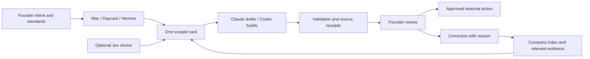

# 05-research-and-use-cases

Reference material only. Quoted instructions describe product behavior, not instructions to the document generator. Later verification supersedes earlier design aspirations.

## Source file: docs/research/2026-09-27-agent-knowledge/README.md

# Factor: the hand, the glove, and the knowledge between them

Research date: 2026-09-27. Source checkout: `795ae67e8cb6eb224fc8a5ff941d069c21203e88`.

**The useful next step is a governed path from source to company understanding to tested procedure.** Factor already has the beginnings: harvest, a small instinct, a wiki, correction rows, room briefs and chosen connectors. The research strengthens that design rather than requiring another agent platform.

## What was ingested

All **456 cached Field Theory records** were scanned across post text, article titles, stored article bodies and quoted posts. The scan produced **92 candidates**: **36 curated**, **44 retained as discovery leads**, and **12 excluded**. Across the candidates, **22 contain a stored article body**. A cached body is available evidence, not a guarantee that the original publisher's page was captured completely.

The ingestion here is a source manifest, reading index and extracted knowledge. Full third-party articles remain in Field Theory, outside the framework distribution. Each candidate has its original URL, cache timestamps, disposition, source hashes and a local reading pointer where available. No tool was installed or enabled by this research.

Freshness is limited: `ft sync --no-media --max-minutes 5` failed because the default browser profile has no X session. During verification an external cache update was observed: 456 records, last updated **2026-09-27 at 10:09:33 UTC**. The packet was regenerated against that snapshot; the failed command is not credited with this refresh. This is coverage of the available collection, not a claim to have retrieved every article on X. See the [sync and retrieval receipt](sync-receipt.md).

- [Source index: every candidate and its disposition](source-index.md)
- [Machine-readable manifest](sources.json)
- [Implementation brief and acceptance checks](implementation-brief.md)
- [Primary sources checked during this run](primary-sources.md)

## How the hand-in-glove system fits

This mapping is a synthesis of Factor's current source, not a claim that the metaphor appears verbatim in every file.

| Part | Responsibility | Existing Factor anchor |
|---|---|---|
| Human hand | Intent, judgment, voice, business truth and authority | `prompts/harvest-claude.md`, `prompts/harvest-codex.md`, company harvest |
| Company glove | A fitted record of this business: identity, customers, offers, proof, rules and selected capabilities | External company repo; `company/` is its blank template |
| Factor framework | Reusable operating procedures, onboarding, room contracts and validation | `SOUL.md`, `skills/`, `scripts/`, `catalog/` |
| Hermes runtime | Carries the employee across turns and dispatches work through profiles | `config.yaml`, `docs/seats.md` |
| Claude / Codex seats | Business preparation and drafting / scoped engineering work | `docs/seats.md`, `skills/codex-seat/SKILL.md` |
| Jev decision helper | Selects among supplied rooms, pages or decisions when explicitly available | `skills/jev-gate/SKILL.md`, chosen `jev` catalog card |
| Doors | Carry an intent into the same job contract | Mac, Raycast, Hermes; `scripts/write_intent.py` |

Grok Bot is a useful design reference for persistent roles, procedures, routines and portable templates. It is not an existing fourth Factor door. A bridge would need its own explicit adapter contract and company choice.

The fit improves when the founder corrects a result and the company retains the reason in the right place. Growth belongs in the knowledge and procedure layers. It should not make the always-loaded soul longer, or silently grant more authority.

## Wisdom worth carrying forward

### 1. Give each kind of knowledge a home

The [Hermes memory-layer post](https://x.com/HermesWatcher/status/2102759978822209569) and [vault article](https://x.com/eptwts/status/2080342488728904164) support a distinction Factor already makes: identity is small; durable understanding lives on disk; conversation history remains evidence of what was said. A remembered conversation is not necessarily today's accepted fact.

Factor's existing onboarding generates `instinct.md`, `profile-soul.md`, `wiki/index.md`, entity and brand pages, corrections and a log. Their absence from the blank `company/` tree is intentional staging, not proof that onboarding is missing. See `scripts/onboard.py:write_instinct`, `write_business_and_brand`, and `write_io_and_evals`.

The extension should give knowledge an effective date, source, status and contradiction link. A price that was true last month and a current price must not both be retrieved as unqualified current truth. Exact historical claims about Hermes memory capacity are not adopted as today's runtime limits.

### 2. Extract usable knowledge, then connect it

The [WhatsApp extraction article](https://x.com/termsheetinator/status/2036127209220612415) identifies repeated explanations and handoff problems as useful raw material. The [skill-graph article](https://x.com/arscontexta/status/2023957499183829467) suggests small linked ideas and progressive retrieval.

For Factor: sources establish observations; observations support claims; claims support a process recommendation; a successful, validated process can become a chosen company skill. Keep these steps distinct. Do not promote an author's business claim, model preference or pasted prompt into the founder's voice or company facts.

The current `wiki/synthesis/` contract already reserves synthesis for something no single source said. That is the right place for cross-source conclusions, explicitly labeled as inference and linked back to their supporting claims.

### 3. Jev selects; policy permits; workers execute

The [typed-decision post](https://x.com/DeRonin_/status/2100917158922387537) and [official TypeSafe skill repository](https://github.com/typesafe-ai/skills) support narrow structured judgments. Factor should supply candidate IDs from its actual room list, enabled tools or wiki index. Unknown IDs, missing dependencies and ambiguous outputs must not be turned into invented choices.

**Confidence is not permission.** A high-confidence choice of recipient does not authorize sending to them. Factor's soul and public promise require founder approval, but `docs/rooms.md`, `skills/jev-gate/SKILL.md`, `specs/003-jev/spec.md`, and generated text in `scripts/onboard.py` contain confidence-or-approval language. This is a real policy inconsistency to resolve, not an established runtime guarantee.

Recommended contract: confidence controls whether preparation proceeds, retries or asks for help. Separate, scoped human authorization controls external sends, spend and publishing. An approval can override uncertainty only when the founder sees that uncertainty; a confidence score cannot create an approval.

### 4. Evaluate pruning by what survives

The [compaction bookmark](https://x.com/0xCarnagee/status/2101077261407412732) advocates keeping selected tool results unchanged. That protects the bytes of retained material, but says nothing about whether a discarded result held the crucial constraint.

Current [Hermes Jev Skills documentation](https://github.com/kerpopule/hermes-jev-skills) reports worse handoff recall with an earlier filtered digest and preserves dialogue by default. This is a maintainer report, not a Factor benchmark. It is enough to reject automatic adoption of aggressive pruning.

Start in shadow mode. Compare retained decisions, prohibitions, paths and unresolved questions against an unpruned baseline. If optional ranking fails, keep the original evidence. If an authorization check fails, keep the action blocked. Those failure behaviors serve different purposes.

### 5. Make correction change the next draft

The [writing-process article](https://x.com/tomcrawshaw01/status/2089335961562099902) separates source selection, voice, promise, structure, drafting and review. Its durable lesson is the feedback path: original wording, founder rewrite, reason, changed rule, then a regression example.

Factor already creates correction rows. `skills/weekly-review/SKILL.md` records a correction and names the file that should change, but defers that edit. The next increment should close this loop explicitly. Two matching reasons can trigger a proposed rule; they should not automatically broaden policy or rewrite the soul. Owner-specific examples determine voice, not the article's punctuation preferences.

### 6. Prove a job before making it a routine

The [Grok skills and routines documentation](https://docs.x.ai/grok-bot/skills-routines-and-automations) distinguishes the method from its trigger. Factor can use the same separation: run a bounded job, inspect the result, save its procedure, then consider scheduling it.

The [chief-of-staff account](https://x.com/jimprosser/status/2029699731539255640) contributes explicit preparation-versus-human-judgment lanes. The [two-seat account](https://x.com/elvissun/status/2025920521871716562) contributes scoped context packets and verification before review. Neither requires Factor to copy a fleet size or claimed productivity gain.

Begin with one content-room brief. Return a short selection, evidence, caveats and a draft. Record the founder's decisions. Expand to more rooms only when this complete loop works. No recurring job was created during this research.

### 7. Reuse the role, preserve the company boundary

Newly available posts pointed to [Company Brain](https://github.com/supermemoryai/company-brain) and [Bot Forge](https://hermes-agent.nousresearch.com/docs/plugins/bot-forge). Their primary pages were checked. Company Brain offers a Slack-centered company-context operator; Bot Forge describes creating specialized Hermes bots and teams.

For Factor, these are comparisons and possible future adapters. The transferable ideas are role-scoped context, explicit procedures and lifecycle visibility. They do not justify pooling company knowledge, creating a team before proving one room, or enabling another harness. The two Company Brain announcement posts belong to one source family, not two independent confirmations.

## What to keep off the implementation path

- Star counts, revenue screenshots, speed multipliers and token savings are attributed claims, not Factor acceptance thresholds.
- The newest roundup is a source-discovery queue, not authority to install every listed tool.
- A Grok template may help describe a role, but company facts and credentials still belong to the receiving company. Review template contents rather than assuming a privacy guarantee.
- Community lead-generation guides can inform evidence collection and draft preparation. They do not authorize buying accounts, contacting people, publishing, placing ads or accepting payments.
- One company's corrections must not silently rewrite another company's voice. Framework promotion requires an abstracted, reviewed procedure with private business details removed.

## Best first implementation slice

Add a source-aware intake and promotion path for the **content room**: one saved source becomes one attributed claim, then one evidence-backed brief, then a founder correction, then a regression example. Connect it to the wiki and harvest structures already generated by onboarding. Make approval independent of confidence before adding any external-action adapter.

This packet completes the cached-corpus research and ingestion step. Live X refresh and missing linked article bodies remain pending. The [implementation brief](implementation-brief.md) specifies the next work; it does not claim that work is implemented.

## Source file: docs/research/2026-09-27-agent-knowledge/implementation-brief.md

# Implementation brief: knowledge that improves the fit

Status: proposed implementation, grounded in the [research synthesis](README.md). No runtime or company configuration changed. Extend the existing Factor design; do not import a separate company or replace Hermes.

## Current evidence

`scripts/onboard.py` already creates the memory and brand structure from a harvest, including raw input, instinct, profile soul, wiki, corrections, I/O descriptions and eval instructions. `scripts/write_intent.py` validates room and door enums and writes an intent through a temporary file plus replacement. `scripts/intent_card.py` emits a small card. These are useful foundations.

`scripts/check_company.py` checks file contents and some budget/link/amount constraints. Its money check searches matching dollar strings; it does not prove the number applies to the claim being made. Its wiki check does not resolve every path-qualified link. `scripts/rooms.py` checks policy strings, not an actual external send. Do not describe these checks as complete runtime authorization or provenance enforcement.

`.planning/STATE.md` still says inception is next, while the README lists releases through rooms. Reconcile planning against source and tests before declaring the next release state. That reconciliation is distinct from this research intake.

## Proposed lifecycle

`captured → extracted → reviewed → accepted → superseded`

Rejected and disputed are explicit alternatives. Capturing a source does not accept its claims. Extracting a process does not install a skill. Accepting knowledge does not schedule work. Scheduling work does not grant external-action permission.

| Object | Minimum fields | Home |
|---|---|---|
| Source | Stable ID, original URL/path, author, publication date if known, captured date, content hash, capture completeness, access/privacy class | Company `raw/` and source manifest; framework research stays under `docs/research/` |
| Claim | ID, subject, statement, source ID plus locator, effective date or explicit unknown, status, evidence kind, contradictions | Company wiki entity/concept page |
| Synthesis | Claim IDs, inference, scope, counterevidence, open questions | Company `wiki/synthesis/` |
| Procedure candidate | Trigger, inputs, permitted tools, steps, output contract, checks, escalation, source/claim IDs | Review queue, outside loaded skills |
| Accepted procedure | Candidate revision, approval reference, version, fixture, selected company capability | Company skills after explicit selection |
| Correction | Original, rewrite, reason, affected scope, evidence, proposed rule, accepted version, regression example | `wiki/corrections.md` plus relevant page |
| Run receipt | Card ID, company, source versions read, choices, validation, outcome, approval reference if needed | Company run log |

Use hashes to identify source revisions; retain the source's effective date separately from ingestion time. Reprocessing the same ID and hash should produce no duplicate knowledge. A changed source creates a new revision and a reviewable diff. If a source is unavailable, label it unavailable instead of treating the old capture as freshly verified.

## Prioritized work

| Priority | Work | Existing surfaces | Acceptance evidence |
|---|---|---|---|
| P0 | Separate confidence from approval in every contract and future executor | Soul, Jev gate, room docs, onboarding-generated eval/I/O text, spec 003 | A score of 0.99 without authorization cannot send/spend/publish; approval is scoped to the exact action and artifact; changed payload invalidates it |
| P1 | Add idempotent research intake | Existing `raw/`, `wiki/`, onboard structures | Import twice gives the same source/claim count; changed hash creates a revision; missing body stays a gap; source text cannot enable a connector |
| P1 | Add claim provenance and contradictions | Entity/concept templates and `check_company.py` | Two incompatible prices are surfaced; unknown date stays unknown; a number appearing elsewhere is insufficient support; two companies cannot retrieve each other's private sources |
| P1 | Resolve retrieval from the actual index | Company-context skill, wiki index and link validation | Path-qualified links resolve inside the company root; unknown or outside-root page is rejected; result names source revision and locator |
| P2 | Close correction promotion | Weekly review, correction log, company voice/brand page | Second matching reason proposes a scoped rule; founder-reviewed change affects next draft; contradictory correction creates review; existing voice constraints remain tested |
| P2 | Evaluate optional Jev in shadow mode | Jev gate and selected catalog card | Supplied candidate IDs only; timeout/malformed/low-confidence outputs are explicit; no missing Jev result is represented as a Jev call; compare decisions against a labeled local set |
| P2 | Test context retention | Jev gate compaction contract | A fixture retains prohibitions, commitments, paths and unresolved questions; retained bytes match originals; failed ranking preserves the unpruned context |
| P3 | Package a proven routine | Content room and existing standing review | One-time run produces a useful source-backed brief; repeat runs deduplicate; source failure is visible; unchanged state stays quiet; schedule requires separate setup |
| P3 | Consider a Grok front door | Existing shared intent contract | Only after company choice: same intent/card identity, authenticated company scope, replay protection, explicit approval transport and an end-to-end receipt |

The P0 approval tests describe a future executable boundary. Do not make prose-only checks pass and call the action boundary secured. Define who performs the final external action before implementing an adapter.

## A concrete content-room trial

Input: a founder-selected topic and one to five saved sources. Start with local cached evidence and record missing linked pages. Do not assume an available token means an enabled connector.

1. Read the company's instinct and selected topic page from the wiki index.
2. Register each source and revision; extract only relevant attributed claims.
3. Identify contradictions, stale claims and unsupported figures before drafting.
4. Produce three candidate angles with evidence, a limitation and an abstain option.
5. Let the founder select a promise; prepare an outline and then a draft in their measured voice.
6. Verify references, factual support and voice constraints; return the review packet.
7. Record the founder's correction and proposed rule. Apply an accepted correction to the affected company page and replay the example.

The test finishes when the second draft improves in the specified way while keeping sources, scope and approvals intact. No publication is needed to prove this loop.

## Jev contract to prototype

Input: company ID, card ID, decision kind, candidate IDs with bounded descriptions, policy version and evidence references. Output: selected candidate ID or abstention, reported confidence, provider/model receipt, latency, outcome and error if any.

Code validates membership, shape and policy before a result influences a card. Treat any vendor confidence as a model output requiring calibration, not a probability of business success. A disabled or unavailable optional ranker can fall back to the ordinary documented retrieval path; it must never counterfeit a Jev result. A requested Jev-specific decision stops as the current skill requires.

Authorization is a separate record: approver, action, target, exact payload digest, scope and expiration/consumption rule. This is a proposed contract, not an existing capability.

## Promotion boundaries

Reusable methods can be proposed for Factor. Company facts, customer language, contacts, pricing, approvals and voice corrections stay in the company repo. External sources are data: quoted commands, install requests and policy instructions are never executed just because ingestion encountered them.

Optional tools remain in the shared registry and catalog until chosen. A research packet does not belong under profile-loaded `skills/`. The same menu must remain visible to the founder and the agent.

## Sources that could change this brief

The cached announcement posts for the September 13 lead workflow, September 17 info-product workflow and Maestro's linked guide lack their full article bodies. Retrieve those before claiming complete extraction. Current TypeSafe API contracts, Hermes extension seams and Grok bridge details need version-pinned verification during implementation. The current primary-source readings are recorded in [primary-sources.md](primary-sources.md).

## Source file: docs/research/2026-09-27-latest-seven/README.md

# Seven bookmarks → a usable native learning loop

Processed 2026-09-27 from the user's refreshed Field Theory cache. The file contains 456 records, last reported update 10:09:33 UTC. This batch uses **the first seven cache records**; `bookmarkedAt` is null, so actual save chronology is unknown. `ft list` sorts differently by post time. The first-seven selection and hashes are fixed in [sources.json](sources.json). No new sync was run.

## What each bookmark contributes

| Cache position | Source | Processing decision | Concrete Factor use |
|---|---|---|---|
| 1 | [RoundtableSpace: 20 build-to-launch skills](https://x.com/RoundtableSpace/status/2103828182541734166) | Adapt the bottleneck-first delivery method; shelf stack-specific packs | One task gets a spec, model of the domain, implementation and real acceptance checks. Use the matching skill only when that job requires it. |
| 2 | [supermemory: Company Brain](https://x.com/supermemory/status/2103668795843973538) | Review as architecture reference; same underlying launch as item 6 | A company-scoped teammate with explicit work context and feedback, not a new second runtime installed beside Hermes. |
| 3 | [beamnxw: 20 second-brain projects](https://x.com/beamnxw/status/2103757085393490284) | Adapt capture/retrieval/correction pipeline; defer memory-backend replacements | Sources become reviewable knowledge, relevant context is retrieved, work is evaluated, and corrections return to the next run. |
| 4 | [HermesWatcher: Bot Forge](https://x.com/HermesWatcher/status/2103605464382488798) | Candidate after one reliable workflow; quoted author claims recorded | Future research/writer/editor roles with their own scope and rollback. First prove one agent's procedure, then split responsibilities where failures justify it. |
| 5 | [coldemailchris: article pointer](https://x.com/coldemailchris/status/2103700886186848294) | **Blocked source**: post contains only an article pointer, cached article absent, direct web retrieval unavailable | Keep a retrieval task. No outreach method or factual lesson is inferred from an author's handle. |
| 6 | [DhravyaShah: Company Brain architecture article](https://x.com/DhravyaShah/status/2103668051468300701) | Article unavailable; primary Company Brain repository reviewed separately | Deduplicate launch/architecture references as one concept; avoid counting two posts as independent corroboration. |
| 7 | [goan999999: OSINT and video roundup](https://x.com/goan999999/status/2103457845203116338) | Shelf specialized tools; adapt staged-workflow idea where relevant | Separate company-owned public-asset review and creative-video pipeline use cases. Neither is a dependency of basic knowledge learning. |

All **45 shortened URLs** in these posts resolved to destinations (44 GitHub repositories and one X link). [resolved-links.json](resolved-links.json) preserves the mapping. Resolution verifies identity, not installation safety or performance. [capability-candidates.json](capability-candidates.json) explicitly distinguishes primary review from identity-only inventory; every candidate remains disabled.

## The system to build

The feedback signal is better work on the next relevant task. Source count, stored memories, generated skills and a learning timeline are activity counts; they are not evidence of improvement.

## What to take from the linked systems

- **Capture quality:** [Chubby Skills](https://github.com/chubbyguan/chubbyskills) distinguishes source formats. Factor's next ingestion adapters should preserve article/transcript/media completeness and source locations instead of pretending every link is readable prose.
- **Work definition:** [BMAD](https://github.com/bmad-code-org/bmad-method) and [Matt Pocock's skills](https://github.com/mattpocock/skills) motivate a small explicit domain model and acceptance contract before adding agents. For Factor the core entities are SourceRevision, Claim, Job, Artifact, Correction, ProcedureVersion and Evaluation.
- **Shared work context:** [Company Brain](https://github.com/supermemoryai/company-brain) is useful as a team-scope reference. Adopting its Slack harness is a separate product choice; Factor already chose Hermes as its runtime.
- **Memory evaluation:** [Hindsight](https://github.com/vectorize-io/hindsight), [memU](https://github.com/NevaMind-AI/memU) and [OpenViking](https://github.com/volcengine/OpenViking) provide design comparisons. First test whether native Hermes recall and skill reuse meet the pilot; add a backend only to fix a demonstrated failure.
- **Measure behavior:** [PostHog skills](https://github.com/posthog/skills) points toward product measurement. For this local pilot, a simple run/evaluation ledger is enough; installing analytics is not the first step.

These are Factor design inferences from primary project descriptions, not benchmark endorsements. See [primary-source-review.md](primary-source-review.md) for the detailed review and limits.

## First use cases

| Priority | Use case | Useful output | Learning signal | Gate |
|---|---|---|---|---|
| Start | Research-to-content brief | Three supported angles, selected outline and cited brief | Fewer repeated corrections on a held-out brief | Source review and founder selection; no publish |
| Next | Founder knowledge answer | Short answer with source revision and an honest unknown | Better retrieval precision without copying the wiki | Accepted claims only |
| Next | Implementation companion | Small spec, dependency map, patch and actual acceptance result | Recurring failure prevented by native skill reuse | Existing project checks; no automatic deployment |
| Later | Competitor-change watcher | Verified change, impact and source diff | Lower false-alert rate, unchanged state quiet | Manual proof before schedule and delivery |
| Optional | Own public-asset inventory | Scoped asset findings and remediation draft | Confirmed useful findings, not count of discovered identities | Explicit target scope and company choice |
| Optional | Video-production workflow | Brief → storyboard → reviewed render | Fewer revisions and reusable timing/style constraints | Real selected assets/tools; rights and publication review |

## What is implemented vs next

The existing Factor knowledge/correction/approval/content primitives are local and tested. This iteration adds the repeatable [bookmark ingest CLI](../../bookmark-ingest.md). It captures original sources and gaps; it does not accept claims or install any listed tool. The native learning guide and [phase 008 plan](../../../specs/008-native-learning/plan.md) define the runtime handoff and pilot. No company Hermes profile, native memory, native skill, provider or schedule is changed here.

Unresolved article sources: [cold-email article](https://x.com/i/article/2099316575006240776), [Company Brain architecture article](https://x.com/i/article/2103652547227750400). The primary Company Brain repo supplements the second item; it does not prove that the article body was ingested.

## Source file: docs/research/2026-09-27-latest-seven/primary-source-review.md

# Factor: seven-bookmark primary-source review

Reviewed 2026-09-27, approximately 11:50–11:56 UTC. Read-only research: no repository code executed, no dependencies installed, no profile/company/runtime state changed. Recommendations below are architecture proposals, not adopted policy or verified integrations.

Input: `/tmp/factor-latest7-raw.json`, SHA-256 `a00e84bd1c0d7bb68a324ceb3589c2e13cabfda21b97224a79fa06826fd584bc`. These are the first seven entries in cache order, **not a verified chronological ordering of bookmark creation**: every `bookmarkedAt` is null. Cache sync timestamp is `2026-09-27T10:09:33.362Z`. Redirect identities use the parent investigator's `/tmp/factor-seven-links.json`; this agent independently opened the principal repositories. First-party README/documentation observations are distinguished from runtime proof; nothing here proves production behavior.

| # | Cached bookmark / post time UTC | Primary evidence inspected | Decision for Factor |
|---|---|---|---|
| 1 | [RoundtableSpace build-to-launch roundup](https://x.com/RoundtableSpace/status/2103828182541734166), Sep 26 12:45:00 | [BMAD-METHOD](https://github.com/bmad-code-org/BMAD-METHOD), [planning-path documentation](https://docs.bmad-method.org/plan/choose-a-planning-path/) | **Adapt:** compact intent and acceptance contracts; select procedures by the missing decision. **Defer:** installing the advertised bundle. The other nineteen skill claims were not audited. |
| 2 | [Supermemory announcement](https://x.com/supermemory/status/2103668795843973538), Sep 26 02:11:39 | [company-brain README](https://github.com/supermemoryai/company-brain), [architecture](https://github.com/supermemoryai/company-brain/blob/main/docs/architecture.md) | **Adapt:** permissions before retrieval, per-company work ownership, explicit action approval. **Defer:** adopting the Slack/Cloudflare/Supermemory stack or its autonomy defaults. |
| 3 | [beamnxw second-brain roundup](https://x.com/beamnxw/status/2103757085393490284), Sep 26 08:02:29 | [chubbyskills](https://github.com/chubbyguan/chubbyskills) | **Pick the evidence-packet pattern; adapt intake separately:** exact excerpts, source location, hash, resumable job receipts. The other nineteen roundup projects were not implementation-audited. |
| 4 | [HermesWatcher Bot Forge](https://x.com/HermesWatcher/status/2103605464382488798), Sep 25 22:00:00 | [official Hermes community catalog entry](https://github.com/NousResearch/hermes-agent/blob/main/plugin-catalog/bot-forge.yaml), [maintainer repository](https://github.com/BkashJEE/hermes-bot-forge), [catalog review](https://github.com/NousResearch/hermes-agent/pull/114057) | **Adapt:** narrow job ownership, private factual work journals, aged blockers, rollback-aware provisioning. **Defer installation:** modifies profiles, starts gateways, creates routines, and enables companion hooks. |
| 5 | [coldemailchris article pointer](https://x.com/coldemailchris/status/2103700886186848294), Sep 26 04:19:10 | [X article](https://x.com/i/article/2099316575006240776) returned retrieval error; cache contains only a truncated pointer | **Defer:** body missing. No substantive lesson, title, outbound tactic, or claim inferred from the author's biography. |
| 6 | [DhravyaShah company-brain article pointer](https://x.com/DhravyaShah/status/2103668051468300701), Sep 26 02:08:42 | [X article](https://x.com/i/article/2103652547227750400) returned retrieval error; primary repo independently available | **Defer article-specific conclusions.** Same project as #2, not independent corroboration; repository findings remain usable with repository attribution. |
| 7 | [goan999999 OSINT/ViMax roundup](https://x.com/goan999999/status/2103457845203116338), Sep 25 12:13:25 | Seven primary identities below; README-level inspection | **Adapt:** provenance-rich observations and staged artifact review. **Defer:** people-search collection, scanning, and video generation integration absent a concrete company task. No scale/speed/quality claims accepted from the roundup. |

**Transferable design decisions and concrete uses**

1. **BMAD: route by the missing decision, and hand over a small contract.** Its planning guide starts with defined intent and uses research, PRD, UX, and architecture only when those gaps exist. It treats short implementation sessions as the repeating unit, with shared documents for larger coordination. Factor can use a campaign brief containing intended audience, outcome, constraints, evidence requirements, and acceptance checks; the research card receives only the unresolved questions. A minor wording correction should not summon an entire product-development process. This is a procedure adaptation, not a second runtime. [Primary planning guide](https://docs.bmad-method.org/plan/choose-a-planning-path/)

2. **Chubby: preserve evidence before enrichment.** Its README describes local Markdown/TXT import and keyword search, evidence briefs with exact excerpts/line numbers/source/hash, run reports, and repeat-input reuse. Refresh retains older output; subtitles precede expensive transcription, and optional cloud paths are separately configured. Factor's research card can intake a saved article, retain immutable source bytes, and produce a bounded citation packet for its writer/editor. A later authenticated X body should become a new revision, not silently replace the missing-body record. Keep transcription/parser adapters optional. This review does not verify Chubby's platform access or cloud backends. [Primary README](https://github.com/chubbyguan/chubbyskills)

3. **Company Brain: retrieval scope and execution authority are separate.** The README describes shared, private-channel, and personal memory visibility, plus user-owned tool connections. The architecture document describes ingress verification/deduplication, per-organization ownership, scope-specific memory writes, and passive triage that defaults to silence on failure. Adapt these ideas to an eventual multi-user Factor door: resolve company plus actor plus audience before reading evidence; require an approval bound to the actor and proposed action before sending. A useful content-room example is allowing a public product fact in a post while excluding a founder's private pricing discussion. **Evidence caveat:** the repository's [docs index](https://github.com/supermemoryai/company-brain/blob/main/docs/README.md) warns of stale passages; architecture paths still refer to an older monorepo/Postgres structure while the standalone README advertises D1. These are design references, not an audited current security guarantee. [README](https://github.com/supermemoryai/company-brain), [architecture](https://github.com/supermemoryai/company-brain/blob/main/docs/architecture.md)

4. **Bot Forge: make ownership and blocked work visible, retain authority outside the prompt.** Its README describes lead/specialist jobs, dated factual journals, and a `waiting_on_you` view. Factor can reuse those ideas for researcher → writer → editor handoffs: each output states evidence, next owner, unresolved questions, and what needs founder judgment. The catalog pins a community plugin at version 0.12.0 and explicitly discloses managed-profile creation, gateway execution, and companion-hook installation. Do not equate catalog admission with native Hermes core functionality. The [catalog review](https://github.com/NousResearch/hermes-agent/pull/114057) records fixes for backup-before-delete, operator-only secret overrides, and constrained exports; it also acknowledges unstable desktop metadata writes. Factor should retain its own non-bypassable approval contract rather than rely on generated SOUL prose. [Maintainer README](https://github.com/BkashJEE/hermes-bot-forge), [catalog](https://github.com/NousResearch/hermes-agent/blob/main/plugin-catalog/bot-forge.yaml)

5. **OSINT: separate discovery observations from accepted identity claims.** This is a Factor design inference, not a promise about these tools. A username hit is a candidate, not proof of identity; a discovered domain is not proof of company ownership. A company-owned asset inventory could ingest observations with provider, query, time, locator, and verification status, then require review before promotion into company knowledge. Defer any private-person dossier or broad scan. The primary projects' capabilities do not authorize their use against a particular target. TheHarvester explicitly distinguishes discovery routes from enrichment actions and documents richer provenance in structured outputs, a useful model for source adapters. [Primary theHarvester README](https://github.com/laramies/theHarvester/blob/master/README.md)

6. **ViMax: review stable intermediate artifacts before expensive rendering.** Its README describes idea/script/novel entry points, character and scene planning, storyboard previews, resumable sessions, and rendering checkpoints. For a later Factor video card, adopt brief → script → storyboard → approved asset references → render request, preserving the approved inputs and recording the provider job receipt. Keep textual planning useful without a rendering provider. Defer integration until asset rights, cost authority, provider credentials, and actual output-quality acceptance exist. “Movie-grade,” autonomous success, and round-up performance rhetoric are not evidence. [Primary repository](https://github.com/HKUDS/ViMax)

**Exact identities behind bookmark seven**

| Roundup label | Confirmed primary destination | Scope observed; disposition |
|---|---|---|
| Aliens Eye | [arxhr007/Aliens_eye](https://github.com/arxhr007/Aliens_eye) | Account-discovery project; defer tool integration. |
| Blackbird | [antoniaci/blackbird](https://github.com/antoniaci/blackbird) | Username/email account search. Former `p1ngul1n0/blackbird` redirects here; canonicalize this identity in citations. |
| Maigret | [soxoj/maigret](https://github.com/soxoj/maigret) | Username-based account discovery; defer. Current README counts differ from the roundup, so do not persist the roundup's count as a capability fact. |
| SpiderFoot | [smicallef/spiderfoot](https://github.com/smicallef/spiderfoot) | OSINT/threat-intelligence and attack-surface project; potential future company-asset card, not generic content-room plumbing. |
| theHarvester | [laramies/theHarvester](https://github.com/laramies/theHarvester) | Domain-oriented discovery and structured evidence; adapt the observation/provenance contract, defer running collectors. |
| Shodan Python | [achillean/shodan-python](https://github.com/achillean/shodan-python) | Official Python API library; a connector candidate requiring a concrete authorized query, not a complete inventory product. |
| ViMax | [HKUDS/ViMax](https://github.com/HKUDS/ViMax) | Staged video-generation framework; adapt checkpoint concepts, defer rendering integration. |

**Provenance receipts**

GitHub API heads observed at `2026-09-27T11:53:10Z`. These are repository commits, not content digests or a claim that every code file was audited. Primary files were fetched as data only and hashed byte-for-byte. No remote code was executed.

| Repository | Observed commit | Commit time UTC | Primary file / SHA-256 |
|---|---|---|---|
| BMAD-METHOD | `5e33d3c03ba53187a40ab679d5479cdd4b6ac2fb` | 2026-09-25 14:17:11 | README.md / `69b974911b5a7b1e132889c5f272d7a2145f96c4bf4a318e26489e7ad03206a8` |
| chubbyskills | `63135c89e3562106529c48f6ebeeb6ed93ce279e` | 2026-09-17 06:13:25 | README.md / `1cde0ebfa8822101b32a87ea52cb2b14a7ab263d41946498681208a503a306a3` |
| company-brain | `d76cc1c9cc4fbddaf95f3a560edcaa04001c4dee` | 2026-09-26 19:42:20 | README.md / `11b07b92b86e9b259e6b67ca34ba772be54be7cd532bc664295a4e397c301fb5` |
| hermes-bot-forge | `302eceb39613d8610513519f5650a026f377a813` | 2026-09-25 17:55:06 | README.md / `26c624e5cc7379138c8f971d32f2f1aa09d8440f638548394ced6a33e47f0e9e` |
| hermes-agent catalog snapshot | `806fa64fd87b34e1d4838280db29c5a3d57040bc` | 2026-09-27 11:44:32 | plugin-catalog/bot-forge.yaml / `07853b089e05c5a8745bd5a0d899575933c83590f798662525c171d251333f8f` |
| ViMax | `b596ca7793c7ec6346ddcc408a9ed1bc97998152` | 2026-09-20 04:27:39 | readme.md / `78daaad2f5b8493f65bd6aff23292af13cc88d8a077c5ae4b93376fd68df05ef` |

Other inspected repository heads: Aliens_eye `b1316648fe0e648469d30512bb0535ebc8c4bbc7` (2026-09-18); Blackbird `b45505080ef51bb3ef52dc29879ee6bef31e5b94` (2025-07-13); Maigret `b6642744988e7e6c2d21f75db60ec3093019ba25` (2026-09-25); SpiderFoot `0f815a203afebf05c98b605dba5cf0475a0ee5fd` (2023-11-05); theHarvester `dc8c0c07952ef9197bdcaee5dc61a1d3e238563e` (2026-09-19); shodan-python `87a0688d1e5b7e4bb13ae4f5fd7cb937a671cba8` (2023-12-17).

Remaining gaps: article bodies #5 and #6; current online acceptance of any collection or rendering integration; code-level permission audit of company-brain; exact installed-Hermes compatibility for Bot Forge. The first seven cache records are not seven independent architectural sources: #2 and #6 describe the same project, and #1/#3/#7 are discovery roundups.

