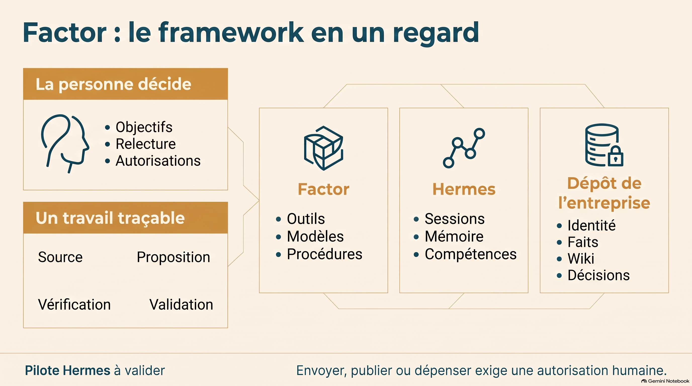

# Découvrir Factor

[English](learning.md) · **Français**

Commencez par le guide du framework, puis suivez le guide opérationnel pour votre première entreprise et votre première tâche. L’anglais est la langue par défaut ; le français est un choix explicite. Le pilote d’apprentissage natif Hermes reste à valider.

| Votre besoin | Ressource |
|---|---|
| Comprendre l’architecture | [Guide du framework](ecosystem/2026-09-27/ecosystem.fr.md) |
| Configurer et réaliser une première tâche | [Guide opérationnel](ecosystem/2026-09-27/playbook.fr.md) |
| Installer ou mettre à jour avec un assistant | [Prompt à copier](../prompt-install.md), en demandant des réponses en français |
| Lire les guides en anglais | [Framework](ecosystem/2026-09-27/ecosystem.en.md) · [Opérations](ecosystem/2026-09-27/playbook.en.md) |

## Présentations, vidéo et infographies

| Support en français | Ouvrir ou télécharger |
|---|---|
| Comprendre le framework — 8 diapositives | [PDF](assets/fr/framework-slides-v2.pdf) · [PowerPoint](assets/fr/framework-slides-v2.pptx) |
| Du travail à l’apprentissage — 8 diapositives | [PDF](assets/fr/operations-slides-v2.pdf) · [PowerPoint](assets/fr/operations-slides-v2.pptx) |
| Vue d’ensemble — 5 min 10 s | [Vidéo MP4](assets/fr/overview-video.mp4) |
| Architecture en un regard | [Infographie PNG](assets/fr/architecture-infographic-v2.png) |
| Apprendre d’un travail vérifié | [Infographie PNG](assets/fr/learning-infographic-v2.png) |



Légende à conserver avec l’infographie d’apprentissage : **protocole proposé ; pilote Hermes à valider**. Les présentations et infographies ont été relues visuellement. Le décodage de la vidéo et un échantillon de ses images ont été contrôlés ; la narration n’a pas été vérifiée indépendamment. Quelques libellés restent imparfaits. [Détails du contrôle](ecosystem/2026-09-27/media-fr/verification.md).

Ces fichiers sont inclus dans le dépôt et accessibles hors ligne. Le [notebook source NotebookLM](https://notebooklm.google.com/notebook/ed5305d5-9bca-4a00-b2a8-5d2f811c1222) nécessite une autorisation d’accès ; aucun compte n’est nécessaire pour ouvrir les fichiers locaux. [Provenance et empreintes](assets/manifest.json). Les médias sont actuellement en français : le choix de l’anglais ne traduit pas leur contenu.

## Les retrouver pendant l’accueil

```sh
python3 scripts/onboard.py --language fr --resources
python3 scripts/onboard.py --language fr --resources --json
python3 scripts/onboard.py --language fr --open-resource framework-guide
```

Le menu interactif propose un choix de langue et des ressources. Le menu Mac propose un sélecteur EN/FR et les mêmes supports. L’ouverture d’un fichier nécessite une action explicite ; l’affichage d’une liste ne lance aucune application et n’installe aucun outil.

## Choisir le français

```sh
# Français pour cette commande seulement.
python3 scripts/onboard.py --language fr --steps

# Conserver le français pour une entreprise.
python3 scripts/onboard.py --company /chemin/absolu/entreprise --set-language fr

# Revenir à l’anglais.
python3 scripts/onboard.py --company /chemin/absolu/entreprise --set-language en
```

La préférence se trouve dans `preferences.json` de l’entreprise : `"language": "en"` ou `"fr"`. En l’absence du fichier, Factor utilise l’anglais. `--language` remplace ce choix pour une seule commande. Le menu Mac partage la préférence de l’entreprise ; avant de choisir une entreprise, son réglage reste limité à la session.

Les instructions Hermes utilisent cette langue pour les explications et les brouillons, sauf consigne explicite de la tâche ou exigence de marque approuvée. Elles ne traduisent pas automatiquement les documents existants, citations ou descriptions du catalogue. Les identifiants des pièces, noms de fichiers, clés JSON et titres structurés du harvest restent stables. Un fichier de préférence invalide est signalé sans être écrasé.

Raycast conserve sa commande anglaise et propose une commande française distincte, car ses libellés sont statiques. Le choix durable de la langue se fait dans le menu Mac ou avec l’accueil en ligne de commande. [Configurer Raycast](../surfaces/raycast/README.md).

[Contrôles de l’implémentation et limites des essais](onboarding-verification.md) (anglais).
