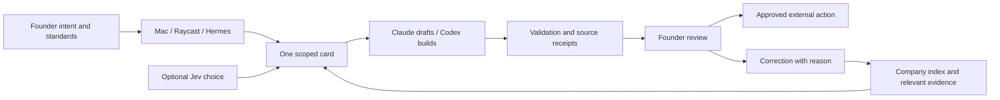

# Factor: the hand, the glove, and the knowledge between them

Research date: 2026-09-27. Source checkout: `795ae67e8cb6eb224fc8a5ff941d069c21203e88`.

**The useful next step is a governed path from source to company understanding to tested procedure.** Factor already has the beginnings: harvest, a small instinct, a wiki, correction rows, room briefs and chosen connectors. The research strengthens that design rather than requiring another agent platform.

## What was ingested

All **456 cached Field Theory records** were scanned across post text, article titles, stored article bodies and quoted posts. The scan produced **92 candidates**: **36 curated**, **44 retained as discovery leads**, and **12 excluded**. Across the candidates, **22 contain a stored article body**. A cached body is available evidence, not a guarantee that the original publisher's page was captured completely.

The ingestion here is a source manifest, reading index and extracted knowledge. Full third-party articles remain in Field Theory, outside the framework distribution. Each candidate has its original URL, cache timestamps, disposition, source hashes and a local reading pointer where available. No tool was installed or enabled by this research.

Freshness is limited: `ft sync --no-media --max-minutes 5` failed because the default browser profile has no X session. During verification an external cache update was observed: 456 records, last updated **2026-09-27 at 10:09:33 UTC**. The packet was regenerated against that snapshot; the failed command is not credited with this refresh. This is coverage of the available collection, not a claim to have retrieved every article on X. See the [sync and retrieval receipt](sync-receipt.md).

- [Source index: every candidate and its disposition](source-index.md)
- [Machine-readable manifest](sources.json)
- [Implementation brief and acceptance checks](implementation-brief.md)
- [Primary sources checked during this run](primary-sources.md)

## How the hand-in-glove system fits

This mapping is a synthesis of Factor's current source, not a claim that the metaphor appears verbatim in every file.

| Part | Responsibility | Existing Factor anchor |
|---|---|---|
| Human hand | Intent, judgment, voice, business truth and authority | `prompts/harvest-claude.md`, `prompts/harvest-codex.md`, company harvest |
| Company glove | A fitted record of this business: identity, customers, offers, proof, rules and selected capabilities | External company repo; `company/` is its blank template |
| Factor framework | Reusable operating procedures, onboarding, room contracts and validation | `SOUL.md`, `skills/`, `scripts/`, `catalog/` |
| Hermes runtime | Carries the employee across turns and dispatches work through profiles | `config.yaml`, `docs/seats.md` |
| Claude / Codex seats | Business preparation and drafting / scoped engineering work | `docs/seats.md`, `skills/codex-seat/SKILL.md` |
| Jev decision helper | Selects among supplied rooms, pages or decisions when explicitly available | `skills/jev-gate/SKILL.md`, chosen `jev` catalog card |
| Doors | Carry an intent into the same job contract | Mac, Raycast, Hermes; `scripts/write_intent.py` |

Grok Bot is a useful design reference for persistent roles, procedures, routines and portable templates. It is not an existing fourth Factor door. A bridge would need its own explicit adapter contract and company choice.

The fit improves when the founder corrects a result and the company retains the reason in the right place. Growth belongs in the knowledge and procedure layers. It should not make the always-loaded soul longer, or silently grant more authority.

## Wisdom worth carrying forward

### 1. Give each kind of knowledge a home

The [Hermes memory-layer post](https://x.com/HermesWatcher/status/2102759978822209569) and [vault article](https://x.com/eptwts/status/2080342488728904164) support a distinction Factor already makes: identity is small; durable understanding lives on disk; conversation history remains evidence of what was said. A remembered conversation is not necessarily today's accepted fact.

Factor's existing onboarding generates `instinct.md`, `profile-soul.md`, `wiki/index.md`, entity and brand pages, corrections and a log. Their absence from the blank `company/` tree is intentional staging, not proof that onboarding is missing. See `scripts/onboard.py:write_instinct`, `write_business_and_brand`, and `write_io_and_evals`.

The extension should give knowledge an effective date, source, status and contradiction link. A price that was true last month and a current price must not both be retrieved as unqualified current truth. Exact historical claims about Hermes memory capacity are not adopted as today's runtime limits.

### 2. Extract usable knowledge, then connect it

The [WhatsApp extraction article](https://x.com/termsheetinator/status/2036127209220612415) identifies repeated explanations and handoff problems as useful raw material. The [skill-graph article](https://x.com/arscontexta/status/2023957499183829467) suggests small linked ideas and progressive retrieval.

For Factor: sources establish observations; observations support claims; claims support a process recommendation; a successful, validated process can become a chosen company skill. Keep these steps distinct. Do not promote an author's business claim, model preference or pasted prompt into the founder's voice or company facts.

The current `wiki/synthesis/` contract already reserves synthesis for something no single source said. That is the right place for cross-source conclusions, explicitly labeled as inference and linked back to their supporting claims.

### 3. Jev selects; policy permits; workers execute

The [typed-decision post](https://x.com/DeRonin_/status/2100917158922387537) and [official TypeSafe skill repository](https://github.com/typesafe-ai/skills) support narrow structured judgments. Factor should supply candidate IDs from its actual room list, enabled tools or wiki index. Unknown IDs, missing dependencies and ambiguous outputs must not be turned into invented choices.

**Confidence is not permission.** A high-confidence choice of recipient does not authorize sending to them. Factor's soul and public promise require founder approval, but `docs/rooms.md`, `skills/jev-gate/SKILL.md`, `specs/003-jev/spec.md`, and generated text in `scripts/onboard.py` contain confidence-or-approval language. This is a real policy inconsistency to resolve, not an established runtime guarantee.

Recommended contract: confidence controls whether preparation proceeds, retries or asks for help. Separate, scoped human authorization controls external sends, spend and publishing. An approval can override uncertainty only when the founder sees that uncertainty; a confidence score cannot create an approval.

### 4. Evaluate pruning by what survives

The [compaction bookmark](https://x.com/0xCarnagee/status/2101077261407412732) advocates keeping selected tool results unchanged. That protects the bytes of retained material, but says nothing about whether a discarded result held the crucial constraint.

Current [Hermes Jev Skills documentation](https://github.com/kerpopule/hermes-jev-skills) reports worse handoff recall with an earlier filtered digest and preserves dialogue by default. This is a maintainer report, not a Factor benchmark. It is enough to reject automatic adoption of aggressive pruning.

Start in shadow mode. Compare retained decisions, prohibitions, paths and unresolved questions against an unpruned baseline. If optional ranking fails, keep the original evidence. If an authorization check fails, keep the action blocked. Those failure behaviors serve different purposes.

### 5. Make correction change the next draft

The [writing-process article](https://x.com/tomcrawshaw01/status/2089335961562099902) separates source selection, voice, promise, structure, drafting and review. Its durable lesson is the feedback path: original wording, founder rewrite, reason, changed rule, then a regression example.

Factor already creates correction rows. `skills/weekly-review/SKILL.md` records a correction and names the file that should change, but defers that edit. The next increment should close this loop explicitly. Two matching reasons can trigger a proposed rule; they should not automatically broaden policy or rewrite the soul. Owner-specific examples determine voice, not the article's punctuation preferences.

### 6. Prove a job before making it a routine

The [Grok skills and routines documentation](https://docs.x.ai/grok-bot/skills-routines-and-automations) distinguishes the method from its trigger. Factor can use the same separation: run a bounded job, inspect the result, save its procedure, then consider scheduling it.

The [chief-of-staff account](https://x.com/jimprosser/status/2029699731539255640) contributes explicit preparation-versus-human-judgment lanes. The [two-seat account](https://x.com/elvissun/status/2025920521871716562) contributes scoped context packets and verification before review. Neither requires Factor to copy a fleet size or claimed productivity gain.

Begin with one content-room brief. Return a short selection, evidence, caveats and a draft. Record the founder's decisions. Expand to more rooms only when this complete loop works. No recurring job was created during this research.

### 7. Reuse the role, preserve the company boundary

Newly available posts pointed to [Company Brain](https://github.com/supermemoryai/company-brain) and [Bot Forge](https://hermes-agent.nousresearch.com/docs/plugins/bot-forge). Their primary pages were checked. Company Brain offers a Slack-centered company-context operator; Bot Forge describes creating specialized Hermes bots and teams.

For Factor, these are comparisons and possible future adapters. The transferable ideas are role-scoped context, explicit procedures and lifecycle visibility. They do not justify pooling company knowledge, creating a team before proving one room, or enabling another harness. The two Company Brain announcement posts belong to one source family, not two independent confirmations.

## What to keep off the implementation path

- Star counts, revenue screenshots, speed multipliers and token savings are attributed claims, not Factor acceptance thresholds.
- The newest roundup is a source-discovery queue, not authority to install every listed tool.
- A Grok template may help describe a role, but company facts and credentials still belong to the receiving company. Review template contents rather than assuming a privacy guarantee.
- Community lead-generation guides can inform evidence collection and draft preparation. They do not authorize buying accounts, contacting people, publishing, placing ads or accepting payments.
- One company's corrections must not silently rewrite another company's voice. Framework promotion requires an abstracted, reviewed procedure with private business details removed.

## Best first implementation slice

Add a source-aware intake and promotion path for the **content room**: one saved source becomes one attributed claim, then one evidence-backed brief, then a founder correction, then a regression example. Connect it to the wiki and harvest structures already generated by onboarding. Make approval independent of confidence before adding any external-action adapter.

This packet completes the cached-corpus research and ingestion step. Live X refresh and missing linked article bodies remain pending. The [implementation brief](implementation-brief.md) specifies the next work; it does not claim that work is implemented.
