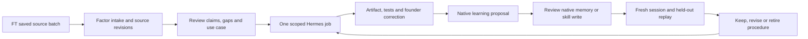

# Seven bookmarks → a usable native learning loop

Processed 2026-09-27 from the user's refreshed Field Theory cache. The file contains 456 records, last reported update 10:09:33 UTC. This batch uses **the first seven cache records**; `bookmarkedAt` is null, so actual save chronology is unknown. `ft list` sorts differently by post time. The first-seven selection and hashes are fixed in [sources.json](sources.json). No new sync was run.

## What each bookmark contributes

| Cache position | Source | Processing decision | Concrete Factor use |
|---|---|---|---|
| 1 | [RoundtableSpace: 20 build-to-launch skills](https://x.com/RoundtableSpace/status/2103828182541734166) | Adapt the bottleneck-first delivery method; shelf stack-specific packs | One task gets a spec, model of the domain, implementation and real acceptance checks. Use the matching skill only when that job requires it. |
| 2 | [supermemory: Company Brain](https://x.com/supermemory/status/2103668795843973538) | Review as architecture reference; same underlying launch as item 6 | A company-scoped teammate with explicit work context and feedback, not a new second runtime installed beside Hermes. |
| 3 | [beamnxw: 20 second-brain projects](https://x.com/beamnxw/status/2103757085393490284) | Adapt capture/retrieval/correction pipeline; defer memory-backend replacements | Sources become reviewable knowledge, relevant context is retrieved, work is evaluated, and corrections return to the next run. |
| 4 | [HermesWatcher: Bot Forge](https://x.com/HermesWatcher/status/2103605464382488798) | Candidate after one reliable workflow; quoted author claims recorded | Future research/writer/editor roles with their own scope and rollback. First prove one agent's procedure, then split responsibilities where failures justify it. |
| 5 | [coldemailchris: article pointer](https://x.com/coldemailchris/status/2103700886186848294) | **Blocked source**: post contains only an article pointer, cached article absent, direct web retrieval unavailable | Keep a retrieval task. No outreach method or factual lesson is inferred from an author's handle. |
| 6 | [DhravyaShah: Company Brain architecture article](https://x.com/DhravyaShah/status/2103668051468300701) | Article unavailable; primary Company Brain repository reviewed separately | Deduplicate launch/architecture references as one concept; avoid counting two posts as independent corroboration. |
| 7 | [goan999999: OSINT and video roundup](https://x.com/goan999999/status/2103457845203116338) | Shelf specialized tools; adapt staged-workflow idea where relevant | Separate company-owned public-asset review and creative-video pipeline use cases. Neither is a dependency of basic knowledge learning. |

All **45 shortened URLs** in these posts resolved to destinations (44 GitHub repositories and one X link). [resolved-links.json](resolved-links.json) preserves the mapping. Resolution verifies identity, not installation safety or performance. [capability-candidates.json](capability-candidates.json) explicitly distinguishes primary review from identity-only inventory; every candidate remains disabled.

## The system to build

The feedback signal is better work on the next relevant task. Source count, stored memories, generated skills and a learning timeline are activity counts; they are not evidence of improvement.

## What to take from the linked systems

- **Capture quality:** [Chubby Skills](https://github.com/chubbyguan/chubbyskills) distinguishes source formats. Factor's next ingestion adapters should preserve article/transcript/media completeness and source locations instead of pretending every link is readable prose.
- **Work definition:** [BMAD](https://github.com/bmad-code-org/bmad-method) and [Matt Pocock's skills](https://github.com/mattpocock/skills) motivate a small explicit domain model and acceptance contract before adding agents. For Factor the core entities are SourceRevision, Claim, Job, Artifact, Correction, ProcedureVersion and Evaluation.
- **Shared work context:** [Company Brain](https://github.com/supermemoryai/company-brain) is useful as a team-scope reference. Adopting its Slack harness is a separate product choice; Factor already chose Hermes as its runtime.
- **Memory evaluation:** [Hindsight](https://github.com/vectorize-io/hindsight), [memU](https://github.com/NevaMind-AI/memU) and [OpenViking](https://github.com/volcengine/OpenViking) provide design comparisons. First test whether native Hermes recall and skill reuse meet the pilot; add a backend only to fix a demonstrated failure.
- **Measure behavior:** [PostHog skills](https://github.com/posthog/skills) points toward product measurement. For this local pilot, a simple run/evaluation ledger is enough; installing analytics is not the first step.

These are Factor design inferences from primary project descriptions, not benchmark endorsements. See [primary-source-review.md](primary-source-review.md) for the detailed review and limits.

## First use cases

| Priority | Use case | Useful output | Learning signal | Gate |
|---|---|---|---|---|
| Start | Research-to-content brief | Three supported angles, selected outline and cited brief | Fewer repeated corrections on a held-out brief | Source review and founder selection; no publish |
| Next | Founder knowledge answer | Short answer with source revision and an honest unknown | Better retrieval precision without copying the wiki | Accepted claims only |
| Next | Implementation companion | Small spec, dependency map, patch and actual acceptance result | Recurring failure prevented by native skill reuse | Existing project checks; no automatic deployment |
| Later | Competitor-change watcher | Verified change, impact and source diff | Lower false-alert rate, unchanged state quiet | Manual proof before schedule and delivery |
| Optional | Own public-asset inventory | Scoped asset findings and remediation draft | Confirmed useful findings, not count of discovered identities | Explicit target scope and company choice |
| Optional | Video-production workflow | Brief → storyboard → reviewed render | Fewer revisions and reusable timing/style constraints | Real selected assets/tools; rights and publication review |

## What is implemented vs next

The existing Factor knowledge/correction/approval/content primitives are local and tested. This iteration adds the repeatable [bookmark ingest CLI](../../bookmark-ingest.md). It captures original sources and gaps; it does not accept claims or install any listed tool. The native learning guide and [phase 008 plan](../../../specs/008-native-learning/plan.md) define the runtime handoff and pilot. No company Hermes profile, native memory, native skill, provider or schedule is changed here.

Unresolved article sources: [cold-email article](https://x.com/i/article/2099316575006240776), [Company Brain architecture article](https://x.com/i/article/2103652547227750400). The primary Company Brain repo supplements the second item; it does not prove that the article body was ingested.
